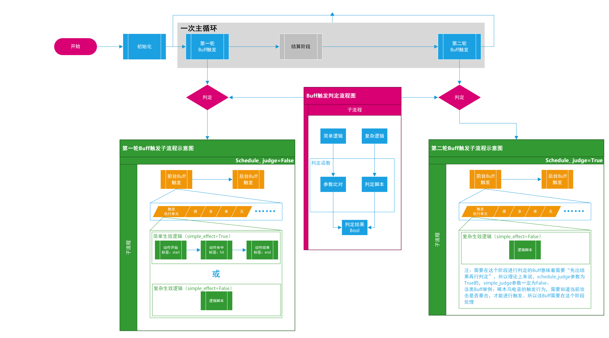
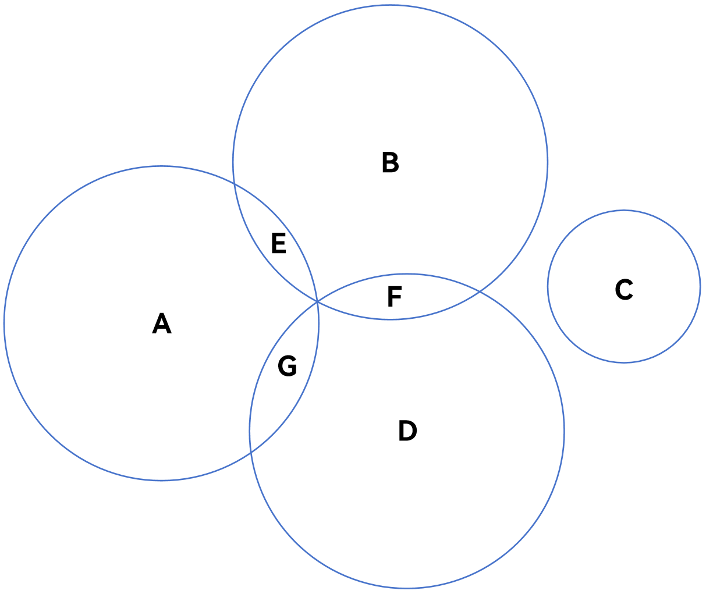

# **ZZZ Simulator 技能数据库录入指南**

## **前言**

> **Buff数据库** 是  **ZZZ Simulator**  中最主要也是最重要的数据库，整个数据结构参考了 `<u>`*WOW早期版本的Buff数据库*`</u>`[^1] ，为了实现Buff的精准、自动触发，我们设计了更加适合《绝区零》需求的Buff *`<u>`触发逻辑`</u>`*[^2] ，在这套逻辑中，我们将Buff的触发规则分解成若干参数，并且根据参数比对和脚本来实现Buff触发的自动判断。
>
> 1:WOW的角色技能多，装备多，所以Buff量很大，所以，想要每一个动作都遍历整个Buff库是不现实的。针对这一需求，WOW的开发团队设计了“Buff链”结构，即“BuffA触发时，会读取‘后续触发ID’，并且根据其中的ID来触发后续的其他Buff”；“Buff链”结构可以在一定程度上简化初次数据的录入，更多时候Buff的触发只依赖Buff ID，而不依赖其他参数。但是也导致了数据库中存在着海量无实际效果的“触发器”，这些空Buff会大幅增加后续的维护成本。
>
> 2:在ZZZ Calculator中，我们并未采用WOW的Buff数据库的链式结构，而是采用了遍历判定的底层逻辑。在初始化时，程序会从总的Buff库中挑选出所有“可能用到的Buff”组建一个临时的Buff库，并且不断遍历这个Buff库，来实现所有Buff的触发判定。这么做的好处是，所有Buff的触发行为都独立，当某个Buff的触发出现异常，就可以直接找到数据库中对应位置进行debug，而不用排查一众指向该Buff的触发器，但是这个结构也有它的劣势，那就是性能上的开销更大。
>
> 3:我们并未完全放弃WOW式的链式结构，《绝区零》中部分复杂Buff仍然需要这种链式结构的帮助，所以我们简单复刻了符合该结构的参数解析，从而在必要时使用链式结构来处理部分复杂Buff

---

## **数据库构成**

|       文件名       | 作用                                                                                                                                                         |
| :-----------------: | :----------------------------------------------------------------------------------------------------------------------------------------------------------- |
|    `飞书表格`    | Buff数据库的预录制平台，我们团队往往会首先在飞书表格中进行Buff的解构、设计以及参数的录入，再由Buff功能负责人虎皮 负责将数据录入到数据库中，并进行debug和测试 |
|  `激活判断.csv`  | 控制Buff是否参与计算，同时记录Buff的判定、生效、结束逻辑，以及持续时间、判定节点等；参数多、复杂度高，是数据录入压力最大的表格。                             |
|  `触发判断.csv`  | 记录Buff的触发规则，参数多，但是目前用到的参数很少，参数数值的确定也十分简单、明确                                                                           |
| `Buff_effect.csv` | 记录Buff的效果，完全不需要考虑逻辑，只需要考虑                                                                                                               |

> ***飞书表格链接：<https://rat0yymldkx.feishu.cn/wiki/Kw3iwAldTiZJA0kt60TceFStnIH?from=from_copylink>***
>
> 如果没有权限，请找Snow或者虎皮。

---

## **录入、更新Buff的工作流**

> 1. 确定Buff名称（按照飞书表格中的命名规则进行命名）
> 2. 根据Buff的文字描述，确定Buff的来源以及激活条件以及触发规则，并且填写 飞书中的 **`激活判断子表`**
> 3. 根据第2步的设计思路，锁定触发条件以及触发参数，填写 飞书中的 **`触发判断子表`**
> 4. 根据Buff的效果，填写 飞书中的 **`Buff_effect子表`**
> 5. 飞书部分录入结束后，将新增的单元格设置为``紫色``，表示 *“录入完成但是等待验证”*
> 6. 通知虎皮，检查录入数据是否正确，并且逐条录入数据库中，
> 7. debug，修复后修改飞书中对应Buff色块为``橙色``，表示 *“Buff录入完成”*

---

## **Buff系统工作流程介绍 & 各参数作用说明**

> - **流程图**
>
>   
>
>       上图即为仿真程序在一个tick（模拟实战中的1帧）内的Buff判定以及触发流程。根据Buff的自身逻辑，分为1、2两轮。两轮的结构与原理大致相同。
>
>       根据Buff的复杂度，可以将其分为“简单Buff”与“复杂Buff”两类，前者的触发行为可以总结为一下三种：
>
>
>       接下来，我将向你介绍各阶段的具体作用以及需要用到的参数及其含义。

> - **初始化**
>
>     这个阶段的主要功能，就是从Buff库中挑选那些“可能会用到的Buff”，并把它们加入到本次模拟所需要的*`<u>`临时容器`</u>`*[^4]里。主要判定依据来自于队伍的初始化信息（角色自身、音擎、驱动盘套装等）。
>
>     该阶段需要检测 **`激活判断.csv`** 中的以下参数：
>
> |        参数        | 数据类型 | 含义                                                                                                                                                                                                                                                                                         |
> | :----------------: | :------: | -------------------------------------------------------------------------------------------------------------------------------------------------------------------------------------------------------------------------------------------------------------------------------------------- |
> |    `BuffName`    |   str   | Buff的中文索引，唯一值                                                                                                                                                                                                                                                                       |
> |   `is_weapon`   |   bool   | 该Buff来自于音擎                                                                                                                                                                                                                                                                             |
> |   `is_debuff`   |   bool   | 该Buff是debuff，决定了Buff是否被添加给enemy。                                                                                                                                                                                                                                                |
> |   `is_cinema`   |   bool   | 该Buff来自于影画                                                                                                                                                                                                                                                                             |
> |      `from`      |   str   | Buff源（角色名、音擎名、驱动盘套装名，enemy）                                                                                                                                                                                                                                                |
> |   `refinement`   |   int   | 精炼等级，该参数是多用途的，默认值为0，当Buff为命座Buff时，该参数为命座数值；当Buff为音擎Buff时，该参数为音擎精炼数值；同时，极少数的复杂Buff也会借用该参数来记录一些特殊数据                                                                                                                |
> |  `add_Buff_to`  |   str   | Buff会加给谁：该参数是一个四位二进制数（虽然设计初衷是字符串，但是在飞书中，它会被默认处理为正常十进制的数字，类似于“0001”这样的会显示成“1”，此时正常进行记录即可，在程序读取前会进行统一的格式化，并且补齐缺少的“0”），从左到右四个数位分别代表了：自己、下一位角色、上一位角色、敌人 |
> | `backend_active` |   bool   | 是否后台激活。程序默认的底层逻辑是“只检测前台角色的Buff”，想要前台角色的某些动作，触发一些后台角色的Buff，那就需要更改此参数为True；举例：“任意队友释放……时，……”，这种Buff就是可以在后台被激活的，所以此参数需要填写True。                                                           |
>
>     这个阶段的运行结果将直接决定接下来整个模拟进程中的全部Buff，如果参数填写错误，那么可能导致本不应该激活的Buff意外激活，或是本应激活的Buff没有激活。``*（比如 `is_cinema`与 `refinement`参数填写错误，可能导致高影画Buff在低影画被触发）*``

> - **第一轮Buff判定介绍 & 主要Buff类型说明**
>
>     这个阶段处理的主要是常规类的Buff，共分为判定、触发两个大板块。
>
>     按照游戏逻辑，Buff判定理应处于伤害计算发生之前，否则当前tick新触发的Buff将无法影响当前tick的伤害计算。最简单的Buff，只要通过参数比对就能判断是否符合触发条件，而复杂一些Buff则需要通过脚本来进行判定。判定板块主要依托于判定函数，其运行结果为一个布尔值。
>
>     总的来说，拆解后的Buff判定规则是比较复杂的，几种主要规则之间都存在交集。为了准确表达这些主要判定规则之间的关系，同时尽量简明地z指出它们的主控参数，接下来我将结合韦恩图和`<u>`*表格*`</u>`[^5] 来进行说明。
>
> 
>
> |            | **更新条件** | **解释**                                                   | **主控参数**                  | **关键词/句**                      |
> | :---------: | ------------------ | ---------------------------------------------------------------- | ----------------------------------- | ---------------------------------------- |
> | **A** | 动作开始           | 在动作的开始标签处（start标签，动作开始的第1帧）发生更新         | `prejudge`                        | 发动XX时……                             |
> | **B** | 动作命中           | 在动作的命中标签处（hit标签）发生更新                            | `hit_increase`                    | ……XX命中时……                         |
> | **C** | 动作结束           | 在动作的结束标签处（end标签，最后一个hit的后1帧）发生更新        | `endjudge`                        | ……XX结束时……                         |
> | **D** | 无持续时间         | maxduration=0[^6]                                                | `maxduration`                     | ……XX技能的……                         |
> |     E*     | 开始+命中          | 在动作开始时触发，在动作命中时更新                               | `prejudge`  `hit_increase` | 发动XX时……，每命中一次……             |
> |     F*     | 命中+无持续        | 动作命中时更新，但Buff只增幅当前动作，所以动作结束时Buff就会结束 | `maxduration` `hit_increase`    | ……XX技能伤害增加，且每命中一次叠层…… |
> |     G*     | 开始+无持续        | 动作开始时触发，动作结束时候结束，                               | `prejudge` `maxduration`   | ……XX技能的伤害增加……                 |

> - **`激活判断.csv`全参数介绍**
>
> 明确了各大类Buff以及它们的主控参数后，我将给出 **`激活判断.csv`** 中所有的参数及其说明。重复出现过的参数，我将从简说明。
>
>   | 参数                      | 数据类型 | ``阶段与功能 | 说明                                                                                                                                                                                                                            |
>   | ------------------------- | -------- | --------------------------------------------------------------------- | ------------------------------------------------------------------------------------------------------------------------------------------------------------------------------------------------------------------------------- |
>   | `BuffName`              | str      | ``全阶段``                               | Buff名，唯一值                                                                                                                                                                                                                  |
>   | `is_weapon`             | bool     | ``初始化``                            | 来源于武器                                                                                                                                                                                                                      |
>   | `is_debuff`             | bool     | ``全阶段``                               | 是debuff                                                                                                                                                                                                                        |
>   | `is_additional_ability` | bool     | ``初始化``                            | 来源于组队被动                                                                                                                                                                                                                  |
>   | `is_cinema`             | bool     | ``初始化``                            | 来源于影画                                                                                                                                                                                                                      |
>   | `from`                  | str      | ``全阶段``                               | Buff源（角色名、装备等）                                                                                                                                                                                                        |
>   | `exist`                 | bool     | ``无``                                  | ``空参数，暂时用不到``                                                                                                                                                                            |
>   | `description`           | str      | ``无``                                  | ``Buff描述，或者其他说明，大多为官方文案的简化版``                                                                                                                                                |
>   | `durationtype`          | bool     | ``无``                                  | ``是否具有持续时间，基本和maxduration是同一个意思，目前程序中用不到这个参数，但是需要正确填写``                                                                                                   |
>   | `maxduration`           | int      | ``判定``                             | 最大持续时间，单位是tick（帧）                                                                                                                                                                                                  |
>   | `maxcount`              | int      | ``判定``                             | 最大层数                                                                                                                                                                                                                        |
>   | `incrementalstep`       | int      | ``判定``                             | 自增步长，即每次叠层时，增加多少层。                                                                                                                                                                                            |
>   | `prejudge`              | bool     | ``判定``                             | 动作开始时触发                                                                                                                                                                                                                  |
>   | `endjudge`              | bool     | ``判定``                             | 动作结束时触发                                                                                                                                                                                                                  |
>   | `freshtype`             | bool     | ``无``                                  | ``重复触发是否能够刷新持续时间，和后面的 hitincrease 参数有重合，该参数暂时用不到，但需正常填写。``                                                                                               |
>   | `alltime`               | bool     | ``判定``                             | 始终触发。该参数为True时，将跳过一切判定直接输出True，将彻底改变Buff的判定、触发、退出行为，总体来说相当暴力、笨重，可控性极差，理论上只要是存在不触发的情况的Buff，该参数都应为False，除非Buff是真的全程触发，该参数才为True。 |
>   | `hitincrease`           | bool     | ``判定``                             | 重复触发是否能够刷新持续时间                                                                                                                                                                                                    |
>   | `increaseCD`            | int      | ``判定``                             | 内置CD，Buff只要不说明，那么就默认为0。单位是tick（帧）                                                                                                                                                                         |
>   | `readyto_increase`      | bool     | ``无``                                  | ``空参数，暂时用不到``                                                                                                                                                                            |
>   | `simple_judge_logic`    | bool     | ``判定``                             | 是否是简单判定逻辑，当Buff触发的判定逻辑比较复杂，通过参数控制无法精准判定Buff触发时，该参数改为False                                                                                                                           |
>   | `simple_start_logic`    | bool     | ``判定``                             | 开始标签处的启动行为是否简单；当Buff属于start更新类型（上表中的A类Buff），且触发时的启动行为较为复杂[^7]的，该参数应改为False                                                                                                   |
>   | `simple_end_logic`      | bool     | ``判定``                             | 结束标签处的启动行为是否简单；当Buff属于end更新类型（上表中的C类Buff），且触发时的启动行为较为复杂的，该参数应改为False                                                                                                         |
>   | `simple_hit_logic`      | bool     | ``判定``                             | 命中标签处的启动行为是否简单；当Buff属于hit更新类型（上表中的B类Buff），且触发时的启动行为较为复杂的，该参数应改为False                                                                                                         |
>   | `simple_effect_logic`   | bool     | ``判定``                             | Buff的启动不依赖于动作的开始、命中、结束标签，而是在另外的时间点来实现触发和启动的，该参数为False。注意，本参数为False时，`simple_judge_logic`参数一般也为False                                                               |
>   | `simple_exit_logic`     | bool     | ``判定``                             | Buff的退出逻辑是否简单；正常情况下，Buff的退出（或者叫消失）仅需要检测持续时间，但是部分Buff的退出逻辑是复杂的（如冲击力小于XX点时，Buff消失），此时，本参数为False                                                             |
>   | `refinement`            | int      | ``灵活``                              | 精炼等级，或者命座，或者其他参数。灵活参数，默认值为0                                                                                                                                                                           |
>   | `add_buff_to`           | str      | ``判定``                             | Buff加给谁，二进制四位数。                                                                                                                                                                                                      |
>   | `schedule_judge`        | bool     | ``判定``                             | 是否是第二轮判定的Buff（对第二轮判定有疑问的，请参考本章节开头给出的流程图，里面有1、2阶段的详细说明和对比）                                                                                                                    |
>   | `individual_settled`    | bool     | ``判定``                             | Buff层数是否独立判定（硫磺石like）                                                                                                                                                                                              |
>   | `backend_acitve`        | bool     | ``判定``                             | 是否在后台也要保持触发检测                                                                                                                                                                                                      |

> - **`触发判断.csv`的作用**
>
>       `激活判断.csv`规定了Buff的基本属性与触发行为，而 `触发判断.csv`则规定了Buff触发所需要的具体条件。由于游戏中大部分的Buff的触发都依赖于角色的主动动作，所以，`触发判断.csv`中的参数大部分都与技能参数相同。所以，为了填写 `触发判断.csv`中的数据，我们需要将触发条件解构成参数，这就要求我们对技能参数的结构也有所了解。
>
>       为此，我制作了Buff判定的原理示意图，来帮助大家理解Buff系统是如何利用通用参数对Buff的触发结果进行判定的。
>
>   
>
>       从上图不难看出，Buff的触发条个数往往是比较少的，而技能的特定参数只要等于触发条件，那么就可以让技能通过判断。
>
>       注意：较为复杂的Buff我们通常都诉诸脚本来实现触发判定，所以这类Buff在`触发判断.csv`中往往不需要填写任何内容（就算填写了也会因为 `激活判断.csv`中的 `simple_judge_logic` 参数为 `False`而直接运行脚本，参数比对这部分逻辑是不会运行的）

> - **`触发判断.csv`全参数介绍**
>
>   > - **关于分隔符**
>   >
>   >   和`激活判断.csv`不同的是，`触发判断.csv`往往需要在一个参数中输入多个互为“或”关系的条件（由于技能的各个参数都明确对应一个数值，所以Buff的触发条件是不需要考虑“与”关系的，只需要考虑“或”关系即可）。我们用 `|`符号 *``（shift+回车上面那个键）``* 来表示“或”，前后没有空格。
>   >
>
> |              参数              | 数据 类型 | 说明 & 使用频率                                                                                                                                                                                                                                                           |
> | :-----------------------------: | --------- | ------------------------------------------------------------------------------------------------------------------------------------------------------------------------------------------------------------------------------------------------------------------------- |
> |          `BuffName`          | str       | 与 `激活判断.csv`一样，该参数为表中的唯一值，是Buff的名字。                                                                                                                                                                                                             |
> |             `id`             | str       | 这里的id指的是技能的id，该参数可以将Buff的触发范围缩小到指定技能                                                                                                                                                                                                          |
> |        `OfficialName`        | str       | ``技能的官方全名*（比如终结技：天霸横空烈轰）*，一般用不到``                                                                                                                                                                                |
> |            `From`            | str       | ``技能来源，即技能所对应的角色名，一般用不到``                                                                                                                                                                                              |
> |        `SpConsumption`        | float     | 技能的能量消耗，``基本上只有在Buff条件为“技能的能耗=X”时才能使用，有这个需求的Buff可以说是十分罕见[^8]，绝大部分情况下该参数是用不到的``                                                                                                  |
> |       `SpRecovery_hit`       | float     | 技能的命中回能，``和上一条相比，这一条的使用频率更低。别说是绝区零了，我玩了那么多的游戏，我都找不出一个以“命中回能等于N点”为触发条件的Buff，所以这个条件一般也是空的``                                                                   |
> |        `Sp_Threshold`        | float     | 技能的能耗门槛[^9]，``同上，用的很少，一般为空``                                                                                                                                                                                            |
> |        `FeverRecovery`        | float     | 技能的喧响值回复，``一般为空，原因与能耗那一条类似，不过多赘述``                                                                                                                                                                            |
> | `ElementAbnormalAccumulation` | int       | 技能的异常积蓄属性类型，大多数时候，该参数与下面的 `ElementType`参数等价，并且在限定元素类型时，通常使用 `ElementType`参数，而非本参数，具体解释详见 ``**附表3**``，``非特殊情况[^10]，该参数为空`` |
> |          `SkillType`          | int       | 技能类型。这里的类型指的是技能大类，具体解释见``**附表1**``                                                                                                                                                                           |
> |      `TriggerBuffLevel`      | int       | 是最常用的技能分类！这个可以理解为技能类型的细分，几乎每一种技能都有单独的参数。具体解释详见``**附表2**``                                                                                                                             |
> |         `ElementType`         | int       | 技能的伤害属性，详细解释见``**附表3**``                                                                                                                                                                                               |
> |          `TimeCost`          | int       | 技能耗时，单位Tick（也就是帧），``该参数不常用，一般为空``                                                                                                                                                                                  |
> |          `HitNumber`          | int       | 技能命中次数，``不常用，一般为空``                                                                                                                                                                                                          |
> |    `DmgRelated_Attributes`    | str       | 造成伤害所依赖的参数[^11]，``现在还用不到，为空``                                                                                                                                                                                           |
> |   `StunRelated_Attributes`   | str       | 计算失衡值所依赖的参数[^11]，``现在还用不到，为空``                                                                                                                                                                                         |
> |   `Interruption_Resistance`   | float     | 技能的抗打断系数，``抗打断模块与Buff判定模块基本不互动，一般情况下为空``                                                                                                                                                                    |
>
> ---
>
>> ``  **附表1：SkillType参数解释**``
>>
>>     `SkillType`主要指的是技能大类，可以简单理解为角色在技能加点时的分类。
>>
>> | 参数数值 | 含义                                                                                             |
>> | :------: | ------------------------------------------------------------------------------------------------ |
>> |  `0`  | 普通攻击，以及其他一切包含普攻标签的内容（比如部分角色6画中常见的附加伤害）                      |
>> |  `1`  | 特殊技，包括E和强化E以及其他一切包含E标签的技能（比如耀佳音的耗能音簇）                          |
>> |  `2`  | 闪避技，包括闪避、闪避反击                                                                       |
>> |  `3`  | 终结技，包括连携技、大招两个技能，                                                               |
>> |  `4`  | 核心被动，这一条暂时没用，因为目前角色的核心被动都是Buff，并没有角色的某个主动技能属于这一标签。 |
>> |  `5`  | 支援技，包括招架/回避支援、突击支援、快速支援（原名：受击支援）                                  |
>>
>
> ---
>
>> ``  **附表2：TriggerBuffLevel参数解释**``
>>
>>  `TriggerBuffLevel`，可以说是最常用参数之一了，Buff库中接近60%数量的Buff需要依靠这一参数来进行判定。可以理解为技能种类的细分，和 `SkillType`作用是一样的。
>>
>> 在使用时，应根据技能判定的需求，在`TriggerBuffLevel`和 `SkillType`中灵活选择。
>>
>> | 参数数值 | 含义                       |
>> | :------: | -------------------------- |
>> |  `0`  | 普通攻击                   |
>> |  `1`  | 特殊级（普通E）            |
>> |  `2`  | 强化E                      |
>> |  `3`  | 冲刺攻击                   |
>> |  `4`  | 闪避反击                   |
>> |  `5`  | 连携技                     |
>> |  `6`  | 终结技                     |
>> |  `7`  | 快速支援（原名：受击支援） |
>> |  `8`  | 招架/回避支援              |
>> |  `9`  | 突击支援                   |
>>
>
> ---
>
>> ``**附表3：ElementType & ElementAbnormalAccumulation 参数解释**``
>>
>>     `ElementType`记录了技能的伤害属性，注意！是伤害属性！在讲解 `ElementAbnormalAccumulation`参数时，已经解释过了为何要把积蓄属性和伤害属性分开，这里就不重复说明了。
>>
>> | 参数数值 | 在 `ElementType`中的含义 | 在 `ElementAbnormalAccumulation`中的含义 |
>> | :------: | -------------------------- | ------------------------------------------ |
>> |  `0`  | 物理                       | 物理积蓄（如果无属性积蓄则为空）           |
>> |  `1`  | 火                         | 火积蓄                                     |
>> |  `2`  | 冰                         | 冰积蓄                                     |
>> |  `3`  | 电                         | 电积蓄                                     |
>> |  `4`  | 以太                       | 以太积蓄                                   |
>> |  `5`  | 烈霜（随星见雅新增）       | 烈霜积蓄（随星见雅新增）                   |
>>
>> 
-------时效性说明-------

>> 
更新日期：2025.2.15

>> 
游戏版本：1.5--伊芙琳

>> 
更新人：虎皮

>>

    最后，为保证数据录入工作顺利，请务必按本文前面给出的工作流程执行录入~感谢您的配合。

虎皮，写于2025.2.15

[^4]: 在程序中，该容器是EXIST_Buff_DICT

[^5]: 表格中，带 * 的项目意味着在数据库中不常见，只有非常少量的Buff才会涉及。

[^6]: 这里并不是指Buff完全没有持续时间，在程序中，只增幅某种技能的Buff（比如下两次普通攻击的伤害增加），虽然理论上持续时间是0，在数据库中，对应的maxduration参数也是0，但是在程序实际运行过程中，这些Buff会被等效看做是“持续时间为动作时间”的Buff来处理。

[^7]: 复杂的触发行为可以理解为，用 `maxduration`、`maxcount`、`incrementalstep`等参数无法实现精确控制的触发行为，比如：某Buff触发时，会根据当前属性值来计算出层数（莱特），亦或是某Buff更新时，会根据另一个Buff的层数来计算自己的层数（青衣专武）等等，这些都属于“复杂触发行为”。

[^8]: 能耗参数几乎用不到的原因是：参数对比模块只会在简单判定逻辑中执行，而这部分的程序只能判断**能耗等于填入数值**的情况。游戏中的Buff，触发条件与能耗有关的本就不多，且它们的触发条件都为“能耗>或者<X”，参数对比模块是处理不了这个需求的，所以此类判定只能通过脚本进行。在我写下此篇技术文档时，正值绝区零的1.5版本，纵观整个游戏，我都找不出一个Buff需要***“技能的能耗恰好为N点时才能触发”***。

[^9]: 顾名思义，能量值大于该数值时，技能才允许被释放。在ZZZ中，耗能技能往往都是存在能耗门槛的，比如某些技能耗能40点，但是拆包发现这些技能拥有20点的能耗门槛，大部分时候，能耗门槛都≤技能能耗，所以该参数很多时候是无意义的，在Buff系统中，以这个参数作为触发条件的情况更加稀少。

[^10]: 大部分时候，技能打什么属性的伤害，就积蓄什么属性的属性异常，比较特殊的情况只有一种，那就是角色的第一段普攻往往造成物理伤害但是无属性积蓄产生，此时，`ElementAbnormalAccumulation`参数为空，而 `ElementType`参数为0。绝大部分时候，两个参数是等价的，且后者更常用。或许以后ZZZ会推出打物理伤害但是积蓄火异常的变态角色，到时候这个参数就有用了！

[^11]: 目前，`DmgRelated_Attributes` 与 `StunRelated_Attributes` 这两个属性是其他模块都用不到的，因为在绝区零的当前版本，伤害就和攻击力挂构，而失衡就和冲击力挂构，这是默认的底层逻辑。但是谁也不知道这个逻辑何时会被打破，前者被打破的概率更高一些，因为总有一天要出生命C的。后者可能晚一些。但是我相信总有一天会用到，所以直接就作为扩展属性先写好了。暂时都默认为空即可。
